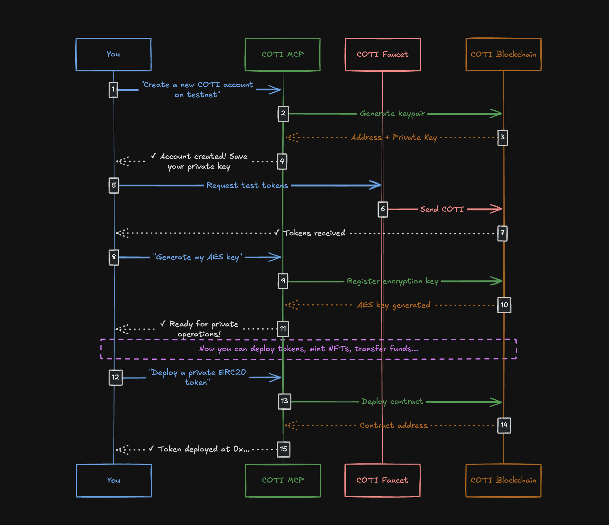

# COTI MCP - Frequently Asked Questions

<div align="center">

[](https://smithery.ai/server/@davibauer/coti-mcp)
[](https://coti.io)
[](https://modelcontextprotocol.io)

**Your AI-Powered Gateway to COTI Blockchain Privacy Features**

---

</div>

## Table of Contents

- [Getting Started](#-getting-started)
- [Account Management](#-account-management)
- [Networks](#-networks)
- [Encryption & Security](#-encryption--security)
- [Smart Contracts](#-smart-contracts)
- [Private ERC20 Tokens](#-private-erc20-tokens)
- [Private ERC721 NFTs](#-private-erc721-nfts)
- [Transactions](#-transactions)
- [Troubleshooting](#-troubleshooting)

---

## Getting Started

<details>
<summary><strong>What is COTI MCP and what can I do with it?</strong></summary>

**COTI MCP** is a bridge that allows AI assistants (like Claude, ChatGPT, etc.) to interact directly with the COTI blockchain through natural conversation.

### What makes it special?

Instead of writing code or using complex interfaces, you can simply **ask** the AI to perform blockchain operations for you:

> *"Create a new COTI account for me"*
>
> *"Deploy a private token called MyToken with symbol MTK"*
>
> *"Transfer 100 tokens to 0x123..."*

### Main capabilities:

| What you can do | Example request |
|-----------------|-----------------|
| **Manage accounts** | *"Create a new wallet"* or *"Import my existing account"* |
| **Private tokens** | *"Deploy a private ERC20 token"* or *"Mint 1000 tokens"* |
| **Private NFTs** | *"Create an NFT collection"* or *"Mint an NFT with this metadata"* |
| **Transfers** | *"Send 50 COTI to this address"* or *"Transfer my NFT"* |
| **Smart contracts** | *"Deploy this Solidity contract"* or *"Call this function"* |
| **Encryption** | *"Encrypt this message"* or *"Sign this data"* |

### Why use COTI for privacy?

COTI uses **Multi-Party Computation (MPC)** technology, which means your token balances and transactions can be **encrypted on-chain**. Only you (with your AES key) can see the actual values!

</details>

<details>
<summary><strong>How does the AI remember my account information?</strong></summary>

Great question! When you interact with COTI MCP, the AI keeps track of your credentials **within the current conversation only**.

### Here's how it works:

1. **You create or import an account** - The AI receives and remembers:
   - Your wallet address
   - Your private key
   - Your AES key (for encryption)
   - Which network you're using

2. **You continue the conversation** - The AI automatically uses these credentials for subsequent operations. You don't need to provide them again!

3. **You close the conversation** - Everything is forgotten. This is a security feature.

### Example flow:

```
You: "Create a new account on testnet"
AI:  ✓ Created account 0xABC... (remembers credentials)

You: "Check my balance"
AI:  ✓ Your balance is 0 COTI (used remembered address)

You: "Deploy a private token"
AI:  ✓ Deployed at 0xDEF... (used remembered private key)
```

> **Important**: Your credentials only exist in the current chat session. If you need to use the same account later, **save your private key** somewhere secure!

</details>

<details>
<summary><strong>What's the difference between testnet and mainnet?</strong></summary>

Think of it like a video game with a practice mode:

| | Testnet | Mainnet |
|---|---------|---------|
| **Purpose** | Practice & development | Real transactions |
| **Tokens** | Free test tokens (no real value) | Real COTI (has monetary value) |
| **Risk** | Zero - make mistakes freely! | Real money at stake |
| **Speed** | Same as mainnet | Same as testnet |
| **Use when...** | Learning, testing, experimenting | Ready for production |

### Our recommendation:

1. **Always start with testnet** - Get free tokens from the COTI faucet
2. **Test everything thoroughly** - Deploy contracts, transfer tokens, try all features
3. **Move to mainnet** - Only when you're confident everything works

### How to switch:

Simply tell the AI:
> *"Switch to testnet"* or *"Switch to mainnet"*

The AI will remember your network choice for all subsequent operations.

</details>

---

## Account Management

<details>
<summary><strong>How do I create my first COTI account?</strong></summary>

Creating an account is as simple as asking! Here's what happens step by step:

### Step 1: Ask the AI
> *"Create a new COTI account on testnet"*

### Step 2: What you get back
The AI will generate and show you:
- **Address**: Your public wallet address (like `0x1234...`) - safe to share
- **Private Key**: Your secret key - **NEVER share this!**
- **AES Key Placeholder**: Will be generated after funding

### Step 3: Save your credentials!
```
⚠️ IMPORTANT: Copy and save your private key somewhere secure!
   The AI will NOT remember it after the conversation ends.
```

### Step 4: Fund your account
For testnet, get free tokens from the [COTI Faucet](https://faucet.coti.io).

### Step 5: Generate your AES key
After funding, ask:
> *"Generate my AES key"*

Now you're ready to use all privacy features!

### Quick summary:
```
Create account → Save private key → Fund account → Generate AES key → Ready!
```

</details>

<details>
<summary><strong>I already have a COTI account. How do I use it?</strong></summary>

You can import your existing account using your private key:

### How to import:
> *"Import my account with private key 0x123abc..."*

The AI will:
1. Derive your public address from the private key
2. Remember your credentials for this session
3. Set up an AES key placeholder

### Do I need to include "0x"?
Either format works:
- `0x123abc...` ✓
- `123abc...` ✓

### After importing:
If your account is already funded and you've used it before, you may need to regenerate the AES key:
> *"Generate my AES key"*

### Security tip:
Never share your private key in public channels. When using COTI MCP, the communication should be in a private, secure environment.

</details>

<details>
<summary><strong>What is an AES key and why is it important?</strong></summary>

The **AES key** is what makes COTI's privacy features possible. Think of it as a special encryption key unique to your account.

### Simple explanation:

| Without AES Key | With AES Key |
|-----------------|--------------|
| Anyone can see your balance | Only YOU can see your real balance |
| Transactions are public | Transaction amounts are encrypted |
| Standard blockchain experience | True financial privacy |

### How it works:

```
Your token balance: 1000 tokens

What others see on blockchain: ▓▓▓▓▓▓ (encrypted gibberish)
What YOU see (with AES key):   1000 tokens
```

### How to get your AES key:

1. **Fund your account** with at least a small amount of COTI (needed to pay for the key generation transaction)

2. **Ask the AI**:
   > *"Generate my AES key"*

3. **Done!** The AI will track it automatically for all private operations

### Why do I need funds first?

Generating an AES key requires a blockchain transaction (it's registered on-chain for security). This costs a small gas fee.

### Important notes:
- Each account has ONE unique AES key
- The AES key is deterministic - you can regenerate it anytime with your private key
- Without it, you cannot use private token features

</details>

---

## Networks

<details>
<summary><strong>How do I switch between networks?</strong></summary>

Switching networks is simple and the AI remembers your choice:

### To switch:
> *"Switch to mainnet"*

or

> *"Switch to testnet"*

### What happens when you switch:

1. All subsequent operations use the new network
2. Your account address stays the same
3. But your **balances are different** on each network!

### Visual example:
```
Testnet account 0xABC: 1000 COTI (test tokens)
Mainnet account 0xABC:    5 COTI (real tokens)
```

Same address, different networks = different balances.

### How to check current network:
> *"What network am I on?"*

### Pro tip:
When starting a new conversation, always specify your network:
> *"Import my account on testnet with private key..."*

</details>

<details>
<summary><strong>How do I get the RPC URL for direct blockchain access?</strong></summary>

If you're a developer who wants to connect directly to COTI (via Web3.js, Ethers.js, etc.), you can get the RPC endpoint:

> *"What's the RPC URL for testnet?"*

### The RPC URLs are:
| Network | Use for |
|---------|---------|
| Testnet RPC | Development, testing |
| Mainnet RPC | Production applications |

### When would I need this?
- Building a custom application
- Using MetaMask or other wallets
- Direct contract interactions outside of COTI MCP
- Debugging and monitoring

For most COTI MCP users, you won't need the RPC URL directly - the AI handles all blockchain communication for you!

</details>

---

## Encryption & Security

<details>
<summary><strong>How do I encrypt sensitive data?</strong></summary>

COTI allows you to encrypt values before sending them to smart contracts. This is how private transactions work!

### When to use encryption:
- Sending private token amounts
- Storing sensitive data in contracts
- Any value you want hidden from public view

### How to encrypt:
> *"Encrypt the value 1000 for contract 0xABC... using the transfer function"*

### What you need to provide:
1. **The value** to encrypt (e.g., token amount)
2. **Contract address** where it will be used
3. **Function** that will receive it (e.g., "transfer")

### Technical details (for developers):

The function selector is a 4-byte identifier. Common ones:

| Function | Selector | Use for |
|----------|----------|---------|
| `transfer(address,uint256)` | `0xa9059cbb` | Sending tokens |
| `approve(address,uint256)` | `0x095ea7b3` | Approving spenders |
| `transferFrom(...)` | `0x23b872dd` | Third-party transfers |

> **Note**: For most private token operations, COTI MCP handles encryption automatically. You only need manual encryption for custom contract interactions.

</details>

<details>
<summary><strong>How do I decrypt encrypted values?</strong></summary>

When you receive encrypted data from the COTI blockchain, you can decrypt it using your AES key:

> *"Decrypt this value: [encrypted_text]"*

### Common scenarios:
- Reading your private token balance
- Viewing encrypted transaction amounts
- Accessing private data from contracts

### Requirements:
- Your account must be the one that encrypted the data, OR
- The data must have been encrypted for your account

### How it works:
```
Encrypted value from blockchain: 0x8f3a2b1c...
After decryption: 1000
```

> **Pro tip**: When using private token tools (like "Get Private ERC20 Balance"), decryption happens automatically!

</details>

<details>
<summary><strong>How do I sign messages and verify signatures?</strong></summary>

Digital signatures prove that a message came from a specific account without revealing your private key.

### Signing a message:

> *"Sign the message 'Hello World' with my account"*

You'll receive a signature like:
```
0x1a2b3c4d...
```

### Common use cases for signing:
- Proving account ownership
- Authenticating to applications
- Creating verifiable attestations
- Off-chain authorization

### Verifying a signature:

> *"Verify this signature [0x1a2b...] was made for message 'Hello World'"*

The AI will tell you which address created that signature, so you can confirm it matches who you expected.

### Real-world example:

```
Website: "Sign this message to prove you own 0xABC..."
You: Sign "Login to MyApp at 2024-01-15 10:30"
Website: Verifies signature → confirms you own the account → grants access
```

No password needed - your signature IS the proof!

</details>

---

## Smart Contracts

<details>
<summary><strong>How do I deploy a smart contract?</strong></summary>

COTI MCP can compile AND deploy Solidity contracts in one step. Here's how:

### Simple deployment:

> *"Deploy this contract:"*
> ```solidity
> // SPDX-License-Identifier: MIT
> pragma solidity ^0.8.20;
>
> contract HelloWorld {
>     string public message = "Hello!";
> }
> ```

### What happens:
1. AI compiles your Solidity code
2. Deploys to your chosen network
3. Returns the contract address
4. Optionally verifies on CotiScan

### With constructor parameters:

If your contract needs initial values:

> *"Deploy this contract with constructor parameters: ['My Token', 'MTK', 18]"*

### Options you can specify:
| Option | What it does |
|--------|--------------|
| `gas_limit` | Set custom gas limit for complex contracts |
| `auto_verify` | Verify source code on CotiScan |
| `solc_version` | Use specific Solidity compiler version |

### After deployment:

You'll receive:
- **Contract address** - Where your contract lives
- **Transaction hash** - Proof of deployment
- **ABI** - Interface for interacting with the contract

> **Tip**: Save the contract address! You'll need it to interact with your contract later.

</details>

<details>
<summary><strong>Can I just compile without deploying?</strong></summary>

Yes! If you want to check your code compiles correctly before spending gas:

> *"Compile this contract (don't deploy):"*
> ```solidity
> // your code here
> ```

### What you get back:
- **Bytecode** - The compiled contract code
- **ABI** - The contract interface (functions, events, etc.)
- **Metadata** - Compiler version, optimization settings

### When to use compile-only:
- Checking for syntax errors
- Getting the ABI for external tools
- Analyzing bytecode size
- Preparing for manual deployment

</details>

<details>
<summary><strong>How do I interact with an existing contract?</strong></summary>

You can call any function on any smart contract:

### Reading data (free, no transaction):

> *"Call the `balanceOf` function on contract 0xABC... with argument 0xDEF..."*

### Writing data (requires transaction):

> *"Call the `transfer` function on contract 0xABC... with arguments ['0xDEF...', '1000']"*

### What you need:
1. **Contract address** - Where the contract is deployed
2. **Function name** - Which function to call
3. **Arguments** - Input values (if any)
4. **ABI** (optional) - For complex or custom contracts

### Two types of functions:

| Type | Cost | Returns |
|------|------|---------|
| `view` / `pure` | Free (no gas) | Data immediately |
| State-changing | Gas fee | Transaction hash |

### Example interaction:

```
You: "Call totalSupply on contract 0x123..."
AI:  Total supply is 1,000,000 tokens

You: "Call transfer on contract 0x123... with args ['0xABC', '100']"
AI:  Transaction sent! Hash: 0xDEF...
```

</details>

---

## Private ERC20 Tokens

<details>
<summary><strong>How do I create my own private token?</strong></summary>

Creating a private ERC20 token is straightforward:

> *"Deploy a private ERC20 token called 'My Private Coin' with symbol 'MPC' and 6 decimals"*

### Step by step:

1. **Choose your token details:**
   - **Name**: Full name (e.g., "My Private Coin")
   - **Symbol**: Ticker symbol (e.g., "MPC")
   - **Decimals**: Precision (usually 6 for private tokens, max 6)

2. **Deploy the contract**

3. **Receive your contract address**

### Why only 6 decimals?

Private tokens on COTI support 0-6 decimals (not 18 like standard ERC20). This is due to encryption constraints but is plenty for most use cases:
- 6 decimals = 0.000001 precision
- 1,000,000 units = 1 token

### After deployment:

Your token starts with 0 supply. Next step: mint some tokens!

> *"Mint 1,000,000 tokens to my address"*

### What makes it "private"?

- Balances are encrypted on-chain
- Only holders can see their own balance
- Transfer amounts are hidden
- Total supply can be public or private

</details>

<details>
<summary><strong>How do I mint new tokens?</strong></summary>

Minting creates new tokens and assigns them to an address:

> *"Mint 10000 tokens from contract 0xABC... to address 0xDEF..."*

### Important notes:

1. **You must be the owner** - Only the contract deployer can mint
2. **Amount in Wei** - The smallest unit of your token

### Understanding Wei:

If your token has 6 decimals:
```
1 token     = 1,000,000 Wei
100 tokens  = 100,000,000 Wei
0.5 tokens  = 500,000 Wei
```

### Quick minting guide:

| Want to mint | With 6 decimals, use |
|--------------|---------------------|
| 1 token | 1000000 |
| 100 tokens | 100000000 |
| 1,000 tokens | 1000000000 |

### Example:

> *"Mint 1000000000 Wei (1000 tokens) to 0xABC..."*

</details>

<details>
<summary><strong>How do I check my token balance?</strong></summary>

To see your private token balance:

> *"What's my balance of token 0xABC...?"*

or

> *"Check balance of 0xDEF... for token 0xABC..."*

### What happens behind the scenes:

1. AI calls the `balanceOf` function
2. Receives encrypted balance from blockchain
3. Decrypts it using your AES key
4. Shows you the actual amount

### Remember:

- Without the AES key, you'll see encrypted data
- You can only decrypt balances for your own account (or accounts you have the AES key for)

</details>

<details>
<summary><strong>How do I transfer tokens to someone?</strong></summary>

Sending private tokens:

> *"Transfer 500 tokens (contract 0xABC...) to 0xDEF..."*

### What you need:
- **Token contract address** - Which token to send
- **Recipient address** - Who receives the tokens
- **Amount** - How many tokens (in Wei)

### The transfer process:

1. AI encrypts the transfer amount
2. Sends transaction to blockchain
3. Recipient's balance updated (encrypted)
4. You receive transaction hash as confirmation

### Privacy in action:

```
On-chain record shows:
  From: 0xYourAddress
  To:   0xRecipient
  Amount: [ENCRYPTED]

Only you and the recipient know the actual amount!
```

### After transfer:

Check your new balance to confirm:
> *"What's my balance now?"*

</details>

<details>
<summary><strong>What are allowances and how do I use them?</strong></summary>

**Allowances** let you authorize another address (like a DEX or smart contract) to spend tokens on your behalf.

### Why use allowances?

Common scenario - using a decentralized exchange:
1. You want to trade Token A for Token B
2. The DEX contract needs to take your Token A
3. You "approve" the DEX to spend your tokens
4. DEX can now execute the trade

### Setting an allowance:

> *"Approve address 0xDEX... to spend 1000 tokens from contract 0xABC..."*

### Checking current allowance:

> *"How much can 0xDEX... spend of my tokens on contract 0xABC...?"*

### Security best practices:

| Practice | Why |
|----------|-----|
| Approve exact amounts | Don't give unlimited access |
| Revoke unused approvals | Set allowance to 0 when done |
| Verify spender address | Make sure it's the right contract |

### Revoking an allowance:

> *"Set allowance for 0xDEX... to 0 on contract 0xABC..."*

</details>

---

## Private ERC721 NFTs

<details>
<summary><strong>How do I create a private NFT collection?</strong></summary>

Creating a private NFT (ERC721) collection:

> *"Deploy a private NFT collection called 'My Secret Art' with symbol 'MSA'"*

### What you define:
- **Name**: Collection name (e.g., "My Secret Art")
- **Symbol**: Short identifier (e.g., "MSA")

### After deployment:

Your collection is ready but empty. Now you can mint NFTs into it!

### What makes private NFTs special?

- **Token URIs can be encrypted** - Metadata hidden from public
- **Ownership queries** - Protected information
- **True digital privacy** - Only owners see their NFT details

</details>

<details>
<summary><strong>How do I mint an NFT?</strong></summary>

Minting creates a new NFT in your collection:

> *"Mint an NFT from collection 0xABC... to address 0xDEF... with URI 'ipfs://Qm...'"*

### What you need:
- **Collection address** - Your NFT contract
- **Recipient address** - Who gets the NFT
- **Token URI** - Link to metadata (usually IPFS)

### About Token URIs:

The URI points to your NFT's metadata (image, description, attributes):

```json
{
  "name": "My NFT #1",
  "description": "A unique digital artwork",
  "image": "ipfs://Qm.../image.png",
  "attributes": [...]
}
```

### URI formats accepted:
- IPFS: `ipfs://Qm123.../metadata.json`
- HTTP: `https://example.com/nft/1.json`
- On-chain: `data:application/json;base64,...`

### After minting:

You'll receive:
- **Transaction hash** - Proof of minting
- **Token ID** - Unique identifier of your NFT

</details>

<details>
<summary><strong>How do I transfer an NFT?</strong></summary>

Sending an NFT to another address:

> *"Transfer NFT #5 from collection 0xABC... to 0xDEF..."*

### What you specify:
- **Collection address** - The NFT contract
- **Token ID** - Which specific NFT
- **Recipient** - New owner's address

### Two transfer methods:

| Method | Use when |
|--------|----------|
| `transferFrom` | Standard transfers |
| `safeTransferFrom` | Recipient is a contract (ensures it can receive NFTs) |

### Using safe transfer:

> *"Safely transfer NFT #5 from 0xABC... to 0xDEF..."*

### Checking ownership:

Before transfer, verify you own the NFT:
> *"Who owns NFT #5 in collection 0xABC...?"*

</details>

<details>
<summary><strong>How do NFT approvals work?</strong></summary>

NFT approvals let others transfer your NFTs. There are two types:

### 1. Single NFT Approval

Allow someone to transfer ONE specific NFT:

> *"Approve 0xMarketplace... to transfer my NFT #5 from collection 0xABC..."*

Use case: Listing ONE NFT for sale on a marketplace.

### 2. Operator Approval (Approve All)

Allow someone to transfer ALL your NFTs in a collection:

> *"Set 0xMarketplace... as operator for all my NFTs in collection 0xABC..."*

Use case: Giving a marketplace access to your entire collection.

### Checking approvals:

```
"Who is approved for NFT #5?" → Shows single approval
"Is 0xMarketplace... an operator for my NFTs?" → Shows operator status
```

### Revoking access:

For single NFT:
> *"Remove approval for NFT #5"*

For operator:
> *"Remove 0xMarketplace... as operator for my collection"*

### Security warning:
Be careful with operator approvals - they have access to ALL your NFTs in that collection!

</details>

<details>
<summary><strong>How do I view NFT details and metadata?</strong></summary>

### Get token URI (metadata link):

> *"What's the token URI for NFT #5 in collection 0xABC...?"*

Returns the link to the NFT's metadata file.

### Other useful queries:

| Question | Command |
|----------|---------|
| How many NFTs do I own? | *"My NFT balance in collection 0xABC..."* |
| Who owns NFT #5? | *"Who owns token #5 in 0xABC...?"* |
| Total NFTs minted? | *"Total supply of collection 0xABC..."* |

### Privacy note:

With private NFTs, the token URI is **encrypted**. Only the owner (with AES key) can see the actual metadata link!

</details>

---

## Transactions

<details>
<summary><strong>How do I check my COTI balance?</strong></summary>

Your native COTI balance (not tokens):

> *"What's my COTI balance?"*

or for another address:

> *"Check COTI balance of 0xABC..."*

### Understanding your balance:

The balance is shown in COTI. Behind the scenes:
```
1 COTI = 1,000,000,000,000,000,000 Wei (10^18)
```

### Why does balance matter?

You need COTI for:
- Gas fees (all transactions)
- Generating AES keys
- Contract deployments
- Token transfers

### Low balance warning:

If your balance is low, you won't be able to:
- Deploy contracts
- Send transactions
- Use private features

Get testnet tokens from the [COTI Faucet](https://faucet.coti.io)!

</details>

<details>
<summary><strong>How do I send COTI to another address?</strong></summary>

Transferring native COTI tokens:

> *"Send 10 COTI to 0xABC..."*

### What you need:
- **Recipient address** - Who receives the COTI
- **Amount** - In Wei (smallest unit)

### Wei conversion:

| COTI | Wei |
|------|-----|
| 0.001 | 1000000000000000 |
| 0.1 | 100000000000000000 |
| 1 | 1000000000000000000 |
| 10 | 10000000000000000000 |

### After transfer:

You'll receive a **transaction hash** - your receipt proving the transfer happened.

### Checking status:

> *"Is transaction 0xDEF... confirmed?"*

</details>

<details>
<summary><strong>How do I check if my transaction went through?</strong></summary>

After any transaction, you can verify its status:

> *"Check status of transaction 0xABC..."*

### What you'll learn:

| Info | Meaning |
|------|---------|
| **Status** | Success, pending, or failed |
| **Block number** | Which block includes your transaction |
| **Gas used** | How much gas was consumed |
| **Confirmations** | How many blocks since your transaction |

### Understanding transaction states:

```
Pending  → Transaction sent, waiting for inclusion
Success  → Confirmed and executed successfully
Failed   → Included but execution failed (gas still charged!)
```

### Why did my transaction fail?

Common reasons:
- Insufficient balance for gas
- Contract reverted (business logic failed)
- Gas limit too low
- Invalid parameters

</details>

<details>
<summary><strong>How do I read transaction logs and events?</strong></summary>

Smart contracts emit **events** during transactions. These are useful for understanding what happened:

### Getting logs:

> *"Get logs for transaction 0xABC..."*

### What you'll see:

Events contain:
- **Event name** (e.g., "Transfer", "Approval")
- **Topics** - Indexed parameters
- **Data** - Non-indexed parameters

### Decoding event data:

> *"Decode the events from transaction 0xABC..."*

### Example - Token Transfer Event:

```
Event: Transfer
From:   0x123...
To:     0x456...
Amount: [encrypted if private token]
```

### When to use this:

- Debugging failed transactions
- Verifying what a contract did
- Building transaction history
- Auditing contract behavior

</details>

---

## Troubleshooting

<details>
<summary><strong>My transaction failed. What went wrong?</strong></summary>

Don't worry - let's diagnose the issue:

### Step 1: Check the error message

Common errors and fixes:

| Error | Cause | Solution |
|-------|-------|----------|
| "insufficient funds" | Not enough COTI for gas | Add more COTI to your account |
| "gas limit exceeded" | Transaction needs more gas | Increase the gas limit |
| "nonce too low" | Transaction ordering issue | Wait for pending transactions to clear |
| "execution reverted" | Contract logic rejected the transaction | Check your parameters |
| "invalid AES key" | Encryption problem | Regenerate your AES key |

### Step 2: Verify your setup

```
Checklist:
[ ] Am I on the right network? (testnet vs mainnet)
[ ] Do I have enough COTI for gas?
[ ] Is my AES key valid? (for private operations)
[ ] Are my parameters correct?
```

### Step 3: Try again

After fixing the issue:
> *"Try the transaction again"*

### Still stuck?

Check the transaction on [CotiScan](https://cotiscan.io) for detailed error information.

</details>

<details>
<summary><strong>Why can't I use private features?</strong></summary>

Private features (encrypted balances, private tokens, etc.) require specific setup:

### Requirements checklist:

| Step | Status | How to fix |
|------|--------|------------|
| 1. Account created/imported | ✓/✗ | Create or import your account |
| 2. Account funded | ✓/✗ | Get COTI from faucet or exchange |
| 3. AES key generated | ✓/✗ | *"Generate my AES key"* |
| 4. AES key tracked | ✓/✗ | Usually automatic |

### Most common issue: Missing AES key

If you see errors like:
- "Cannot decrypt value"
- "AES key required"
- "Invalid encryption"

Solution:
> *"Generate my AES key"*

### After generating AES key:

You should be able to:
- View encrypted balances
- Transfer private tokens
- Mint private NFTs
- Encrypt/decrypt values

</details>

<details>
<summary><strong>I'm getting "account not funded" errors</strong></summary>

This means your account needs COTI tokens before you can proceed.

### For Testnet:

1. Copy your account address
2. Go to [COTI Faucet](https://faucet.coti.io)
3. Paste your address
4. Request test tokens
5. Wait ~30 seconds for tokens to arrive

### For Mainnet:

You'll need real COTI tokens:
1. Purchase from an exchange (Coinbase, Binance, etc.)
2. Withdraw to your COTI address
3. Wait for confirmation

### After funding:

1. Check your balance:
   > *"What's my balance?"*

2. Generate AES key:
   > *"Generate my AES key"*

3. You're ready to go!

</details>

<details>
<summary><strong>My AES key seems wrong or invalid</strong></summary>

AES key issues usually have simple fixes:

### Problem: AES key is a placeholder

If your AES key shows as a placeholder or dummy value:
- Your account needs funding first
- Then regenerate the key

### Problem: AES key doesn't decrypt

Possible causes:
1. **Wrong account** - AES keys are account-specific
2. **Different network** - Keys differ between testnet/mainnet
3. **Corrupted key** - Regenerate it

### Solution: Regenerate your AES key

> *"Generate my AES key again"*

The AES key is **deterministic** - as long as you have your private key, you can always regenerate the same AES key.

### Still not working?

Try this sequence:
1. Import account fresh: *"Import account with key 0x..."*
2. Confirm network: *"Switch to testnet"*
3. Check balance: *"What's my balance?"*
4. Generate key: *"Generate AES key"*

</details>

---

<div align="center">

## Need More Help?

| Resource | Description |
|----------|-------------|
| [COTI MCP on Smithery](https://smithery.ai/server/@davibauer/coti-mcp) | Installation & server details |
| [COTI Documentation](https://docs.coti.io) | Official blockchain documentation |
| [COTI Faucet](https://faucet.coti.io) | Get free testnet tokens |
| [CotiScan](https://cotiscan.io) | Block explorer for transactions |
| [MCP Protocol](https://modelcontextprotocol.io) | Learn about Model Context Protocol |

---

### Quick Start Recap



---

*Built for privacy. Powered by AI.*

</div>
